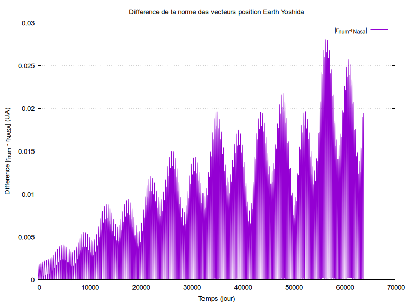

# N-Body Solar System Simulation

A C++/Eigen simulation of the gravitational N-body problem applied to the Solar System, developed for the *LU3PY126 FOAD* numerical project at Sorbonne Université. The simulation integrates the orbits of up to 23 celestial bodies (Sun, planets, moons, asteroids and dwarf planets) using symplectic integrators, and validates the results against real ephemerides from NASA's Horizons system.

**Authors:** Olivier Oribes

📘 Usage guide: [`Mode d'emploi/README.md`](Mode%20d'emploi/README.md) ([original French PDF](Mode%20d'emploi/Mode_d_emploi_programme_V7_norm.pdf))

---

## Overview

The N-body problem describes the motion of $N$ point masses interacting solely through Newtonian gravity. Unlike the two-body problem, it has no general closed-form solution, so the trajectories must be approximated numerically. This project:

1. Simulates the orbital dynamics of the Solar System from real initial conditions (JPL Horizons, epoch 2025-03-13).
2. Compares the simulated trajectories against official NASA ephemerides.
3. Checks two invariants of the physical system: conservation of total energy and Kepler's third law.

Two numerical integrators are implemented and compared: **leapfrog** (2nd order) and **Yoshida 4th order**, both symplectic, meaning they preserve the long-term structure of the Hamiltonian instead of accumulating secular energy drift, unlike Euler or classic Runge-Kutta.

## Physics model

Each body's acceleration is given by Newton's law of gravitation summed over every other body:

$$
\ddot{\mathbf{x}}_i = \sum_{\substack{j=1 \\ j \neq i}}^{N} G \frac{m_j}{\lvert \mathbf{x}_j - \mathbf{x}_i \rvert^3} \left( \mathbf{x}_j - \mathbf{x}_i \right)
$$

which yields a system of $3N$ coupled ODEs. Two implementations of this force calculation are provided:

| Method | Where | Complexity | Notes |
|---|---|---|---|
| **Direct / nested loop** | [`Codes/ProjetcodeV0.cpp`](Codes/ProjetcodeV0.cpp) : `compute_forces_loop` | $O(N^2)$, pairwise | Most intuitive; computes each pair interaction once (`j = i+1`) and applies Newton's third law. |
| **Matrix (Eigen)** | `compute_forces_matrix` | $O(N^2)$, vectorized | Builds the pairwise-distance matrices $X_x, X_y, X_z$ and the gravitational-coefficient matrix $M$, then obtains each acceleration component via an element-wise product and row sum. Preferred in the final program for clarity and for Eigen's vectorized performance. |

### Integrators

**Leapfrog** : position and velocity are staggered by half a time step (`Codes/*.cpp`, `leapfrog_method`):

$$
\mathbf{v}_i(t+\tfrac{\Delta t}{2}) = \mathbf{v}_i(t) + \tfrac{\Delta t}{2}\mathbf{a}_i(t), \quad
\mathbf{x}_i(t+\Delta t) = \mathbf{x}_i(t) + \Delta t\,\mathbf{v}_i(t+\tfrac{\Delta t}{2}), \quad
\mathbf{v}_i(t+\Delta t) = \mathbf{v}_i(t+\tfrac{\Delta t}{2}) + \tfrac{\Delta t}{2}\mathbf{a}_i(t+\Delta t)
$$

**Yoshida 4th order** (`yoshida_step`): composes leapfrog into four sub-steps with the coefficients from Yoshida (1990) to reach 4th-order accuracy at the cost of three force evaluations per step instead of one.

### Energy and Kepler diagnostics

Two further quantities are computed to validate the simulation, isolated as standalone listings referenced in the report:

- **Total energy**, [`Codes/func_energy.cpp`](Codes/func_energy.cpp): kinetic energy $\sum \tfrac{1}{2}m_i v_i^2$ plus pairwise gravitational potential $-\sum G m_i m_j / r_{ij}$. A conservative, isolated system should keep this sum constant.
- **Kepler's third law**, [`Codes/func_kepler.cpp`](Codes/func_kepler.cpp): compares the theoretical ratio $k = T^2/a^3 = 4\pi^2/(G(M+m))$ against the same ratio measured from the simulated Sun-Earth orbit.

## Repository structure

```
.
├── Codes/                               # Source code
│   ├── Projet_Version_V8.cpp            # Final program : 23 bodies, matrix method, Yoshida 4 (build target: `simulation`)
│   ├── Projet_Version_V7_norm.cpp       # Adds orbital-radius / angle / relative-norm diagnostics vs. NASA data
│   ├── Projet_Version_V6.cpp            # Intermediate version : introduces NASA trajectory comparison
│   ├── ProjetcodeV0.cpp                 # First stable version : both matrix AND direct-loop force methods, energy calc
│   ├── func_energy.cpp                  # Isolated energy-conservation routine (report Listing)
│   ├── func_kepler.cpp                  # Isolated Kepler third-law check (report Listing)
│   ├── Animation2D_V1.py                # Matplotlib 2D animation (simulated vs. NASA trajectories)
│   ├── tools/                           # Standalone data-processing helpers (not part of the physics engine)
│   │   ├── dataextraction.cpp           # Parses a raw Horizons text dump into horizons_results_<Body>.txt
│   │   ├── Extraction_diffnorm.cpp      # Splits norm_diff.txt into one file per planet, for Gnuplot
│   │   └── differenceprog.cpp           # Raw coordinate-difference utility (simulation vs. Horizons)
│   └── Makefile                         # Builds the final simulation, older versions, and the tools
├── Fichiers de données Horizon System/  # Raw NASA Horizons ephemerides used as ground truth
├── Gnuplot Script/                      # Plotting scripts for the orbital-difference figures
├── Graphiques/                          # All figures included in the report (energy, Kepler, per-planet diagnostics)
├── Animations/                          # 2D/3D MP4 animations of the simulated Solar System
└── Mode d'emploi/                       # Usage guide: README.md (English) + original French PDF
```

> The four `Codes/*.cpp` program versions (V0, V6, V7 and V8) are kept exactly as submitted. Each version corresponds to a major development milestone, with the header of each source file documenting in detail the features implemented at that stage.

### `tools/` helpers

The three programs in [`Codes/tools/`](Codes/tools) are small, single-purpose utilities used to prepare and post-process data around the main simulation. They have no Eigen dependency and, unlike `simulation`, take no command-line arguments: the input/output filenames (and the target body/integrator) are hardcoded constants inside each `.cpp` file. To reuse a tool on another body or integrator, edit those constants and rebuild with `make tools`.

| Tool | Purpose | Hardcoded input(s) | Hardcoded output(s) |
|---|---|---|---|
| **`dataextraction`** ([`dataextraction.cpp`](Codes/tools/dataextraction.cpp)) | Parses a raw JPL Horizons text export (copy-pasted straight from the Horizons web interface) and extracts the `X`, `Y`, `Z` position triplet from each `X = ... Y = ... Z = ...` line, using the regex `X\s*=\s*([+-]?\d[.\deE+-]*)\s*Y\s*=\s*(...)\s*Z\s*=\s*(...)` to capture scientific-notation floats. Produces one clean `X Y Z` row per timestep. | `horizons_results.txt` | `horizons_results_Saturn.txt` |
| **`extraction_diffnorm`** ([`Extraction_diffnorm.cpp`](Codes/tools/Extraction_diffnorm.cpp)) | Splits a combined 5-column norm-difference file (`time  planet  …  …  norm`) into one 2-column (`time norm`) file per planet, in the format the [`Gnuplot Script/`](Gnuplot%20Script) scripts expect. Recognizes Mercury, Venus, Earth, Mars, Jupiter, Saturn, Uranus and Neptune by name in column 2. | `norm_diff.txt` | `norm_diff_Yoshida_<Planet>.txt` (one per planet) |
| **`differenceprog`** ([`differenceprog.cpp`](Codes/tools/differenceprog.cpp)) | Reads a simulated-trajectory file and a Horizons reference file line-by-line in parallel (each skipping its own header row) and writes the raw per-axis coordinate differences $(\Delta X, \Delta Y, \Delta Z)$ between the two : as opposed to `extraction_diffnorm`, which works on an already-computed Euclidean norm. | `data_YoshidaMercury.txt`, `horizons_results_Mercury.txt` | `differenceMercuryYoshida.txt` |

## Building and running

### Prerequisites

| Requirement | Version |
|---|---|
| C++ compiler | GCC  / Clang |
| [Eigen]([https://eigen.tuxfamily.org](https://libeigen.gitlab.io/))|

### Build

```bash
cd Codes
make            # builds the final simulation -> ./simulation
make v0         # builds the first stable version (matrix + loop methods)
make v6         # builds the intermediate version
make v7         # builds the NASA-comparison version with norm/angle diagnostics
make tools      # builds the data-extraction / post-processing helpers
make clean
```

### Run

```bash
./simulation
```

The NASA reference files (`Fichiers de données Horizon System/horizons_results_<Body>.txt`) must sit in the same working directory as the executable, copy them next to it, or run from that folder. The program prints its total run time and writes its output files (positions, energies, orbital-norm differences, …) in the current directory.

### Visualizing results

1. Run one of the [`tools/` helpers](#tools-helpers) to split the raw diagnostic output into per-planet files.
2. Plot them with the ready-made scripts in `Gnuplot Script/`, or
3. Feed the raw position files to `Codes/Animation2D_V1.py` (requires `matplotlib` + `ffmpeg`) to reproduce the animations found in `Animations/`.

## Results

### Trajectories

Simulated orbits closely track the NASA reference over ~165 years, with the 23-body configuration (adding the Moon, main asteroids and Galilean/Saturnian moons) reducing drift significantly compared to the bare 9-body Sun+planets system. Reducing the time step from 1 day to 1 hour divides the positional error by a factor of 2 to 100 depending on the planet. Uranus and Neptune retain the largest residual drift, plausibly from unmodeled bodies (Kuiper belt objects, satellites) or from neglecting planetary precession/nutation.

<p align="center">
  
  
</p>

### Energy conservation

Total energy (kinetic + potential) stays constant over the simulation, oscillating only within the bounded, periodic error characteristic of symplectic integrators, see [`Graphiques/Energie/energy_val.pdf`](Graphiques/Energie/energy_val.pdf). Jupiter and Saturn alone account for ~95% of the system's kinetic and potential energy, consistent with the virial relation $\langle T \rangle = -\tfrac{1}{2}\langle U \rangle$ measured per planet.

### Kepler's third law

Verified on the Sun-Earth pair in two configurations, see [`Graphiques/Kepler/`](Graphiques/Kepler): an idealized two-body case (other planets' masses minimized, Sun's initial velocity zeroed) reproduces a perfect ellipse and matches the theoretical ratio $k = T^2/a^3$ to within +0.2%; the full 9-body case shows small but measurable perturbations ($\Delta r \approx 0.02$ AU) while the ratio $k$ remains close to its theoretical value.

## Numerical methods comparison

Yoshida 4th order is consistently more accurate than leapfrog (up to 2× for Venus, negligible difference for the outer planets) at a comparable computational cost for this system size: a 200-year / 1-hour-step run took 89.95 s with leapfrog vs. 92.98 s with Yoshida 4.

## Bibliography

Key references used throughout the report :

- H. Yoshida, *Construction of higher order symplectic integrators*, Physics Letters A, 1990.
- E. Hairer, C. Lubich, G. Wanner, *Geometric Numerical Integration*, Springer, 2006.
- F. Mogavero, J. Laskar, *Long-term dynamics of the inner planets in the Solar System*, A&A, 2021.
- F. Mogavero, N. H. Hoang, J. Laskar, *Timescales of Chaos in the Inner Solar System*, Phys. Rev. X, 2023.
- E. V. Pitjeva, N. P. Pitjev, *Mass of the Kuiper Belt*, Celestial Mechanics and Dynamical Astronomy, 2018.
- Data: [JPL Horizons System](https://ssd.jpl.nasa.gov/horizons/app.html), NASA/JPL, downloaded March 2025.

## License

This project is licensed under the BSD 3-Clause License. See the `LICENSE` file for the full license text.
